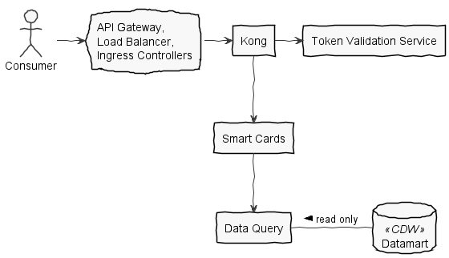

# health-apis-smart-cards

Application that issues Verifiable Health Cards in accordance with the [SMART Health Cards Framework](https://smarthealth.cards). The data provided is backed by the [Data Query](https://github.com/department-of-veterans-affairs/health-apis-data-query).

#### `Modules`

- `pem-to-jwk` - Simple utility to convert PEM-encoded keys to [JWK](https://tools.ietf.org/html/rfc7517)
- `smart-cards` - Main API implementation
- `smart-cards-mock-services` - Mock FHIR server to support local development and integration tests
- `smart-cards-tests` - Integration tests

## System Components

The API Gateway handles authentication and rate limiting before traffic is received by Smart Cards.

- **Kong**
  Responsible for token validation and SMART-on-FHIR OAuth scope enforcement.
- **Smart Cards**
  Smart Cards processes consumer requests for the `/Patient/<<id>>/$health-cards-issue` endpoint.
- **Data Query**
  Data Query provides FHIR-compliant health data for the Patient, enforces additional authorization, and handles processing of private data.
- **Datamart**
  A database within the Corporate Data Warehouse provides read-only data for Data Query. Data available originates from VistA.

---

## Building

Dependencies:

- Java 14 or above
- Maven
- PlantUML for diagrams

To build, run: `mvn clean package`

To skip checkstyle, static analysis, code coverage (etc.), disable the _standard_ profile: `mvn -P'!standard' package`

