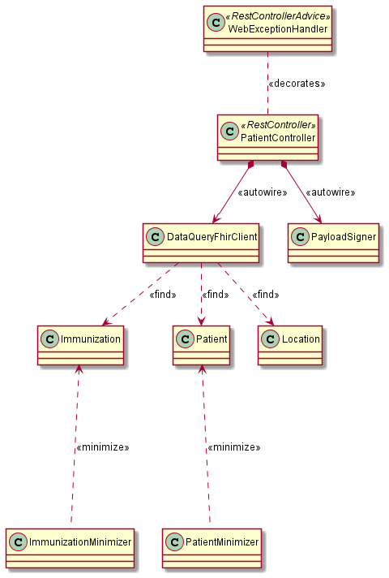
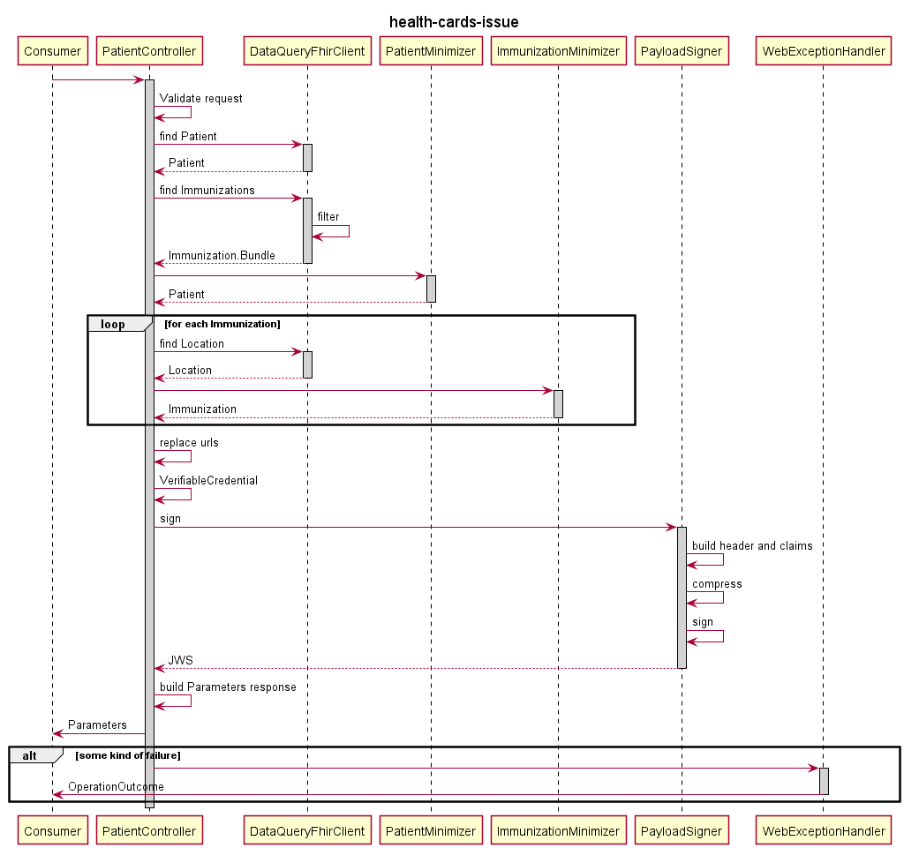

# smart-cards

Main application.

## Local Development

### Configs
Run `make-configs.sh` first (outputs properties to `config` directory):

`./make-configs.sh`

### Build

To run full build:

`mvn clean install`

To run build without additional formatting, code coverage enforcement, static code analysis, integration tests, etc., disable the `standard` profile:

`mvn -P'!standard' package`

Start Java app:

`java -Dspring.profiles.active=dev -jar target/smart-cards-${VERSION}.jar`

## Design

This project uses the Spring Boot framework and follows its conventions.

Below is a basic representation of internal components:

Here is the basic sequence followed to generate a Health Card:

### Components:

- `WebExceptionHandler` - Provides common error handling and `OperationOutcome` generation with appropriate HTTP status codes.
- `PatientController` - Spring Rest Controller responsible for processing the request. It orchastrates the FHIR API lookups, data minimization and transformation requirements, VC object generation, payload signing to JWS, and final Parameters response generation.
- `DataQueryFhirClient` - FHIR HTTP client for communicating with Data Query and filtering out unwanted results.
- `{Resource}Minimizer` - Contains logic to minimize the amount of data to be embedded in the Health Card
- `PayloadSigner` - Handles all logic necessary to generate a JWS
